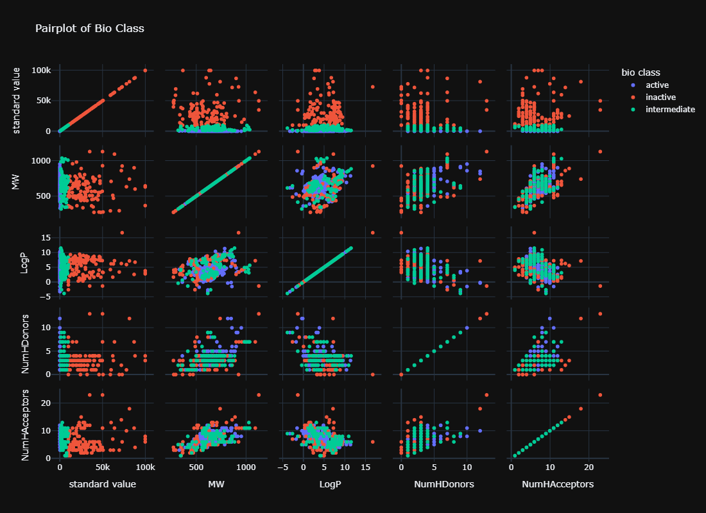

# 👋 Hi, I’m Mostafa
 

 

## About Me  
I’m Mostafa, a passionate and dedicated Data Scientist with a diverse skill set that spans across data science, machine learning, and web development. At just 20 years old, I have honed my abilities in programming, data engineering, and visualization, while also exploring creative problem-solving techniques to address real-world challenges.  

## 👀 I’m Interested In  
- *Data Science*: Transforming raw data into actionable insights.  
- *Machine Learning*: Building and optimizing predictive models.  
- *Web Development*: Crafting seamless user experiences with Laravel and Bootstrap.  
- *Web Scraping*: Automating data extraction to unlock hidden value.  
- *Exploring Technology*: Constantly learning and adapting to new trends and tools in the tech world.  

## 🌱 I’m Currently Learning  
- Advanced machine learning techniques using Sklearn.  
- Interactive dashboards and web apps with *Streamlit*.  
- Leveraging NLP (Natural Language Processing) for better data understanding using *NLTK*.  
- Best practices for creating efficient and scalable APIs with *Laravel*.  

## 💞 I’m Looking to Collaborate On  
- *Data Science Projects*: Especially those involving predictive analytics, data visualization, and ML model development.  
- *Open Source Contributions*: Enhancing tools and libraries in Python, visualization, or scraping.  
- *Web Development Projects*: Combining backend (Laravel) and frontend skills (HTML, CSS, Bootstrap) to build dynamic applications.  

## 📫 How to Reach Me  
  - WhatsApp: [Message me directly](https://wa.me/201154079827)  
  - Facebook: [Message me directly](https://www.facebook.com/share/X3dkSH6LpFqadSQ3/?mibextid=qi2Omg)  
  - Email: mhfarag938@gmail.com   

## ⚡ 
- I’m not only a data scientist but also a chef who loves experimenting with recipes and flavors!  
- I can bench press 120 kg, showing that strength applies both mentally and physically!  
- My nickname is "Toufa," and I enjoy brainstorming creative names for future endeavors.
